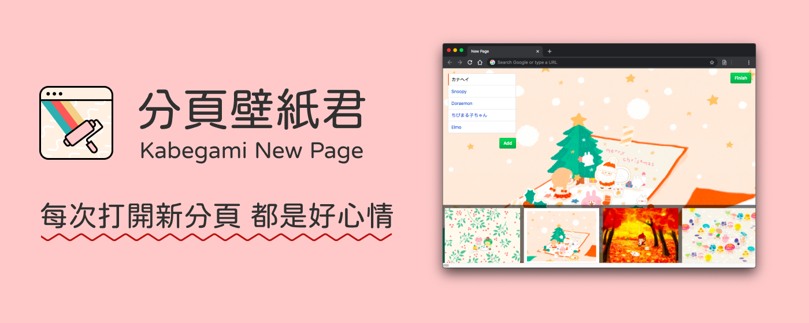
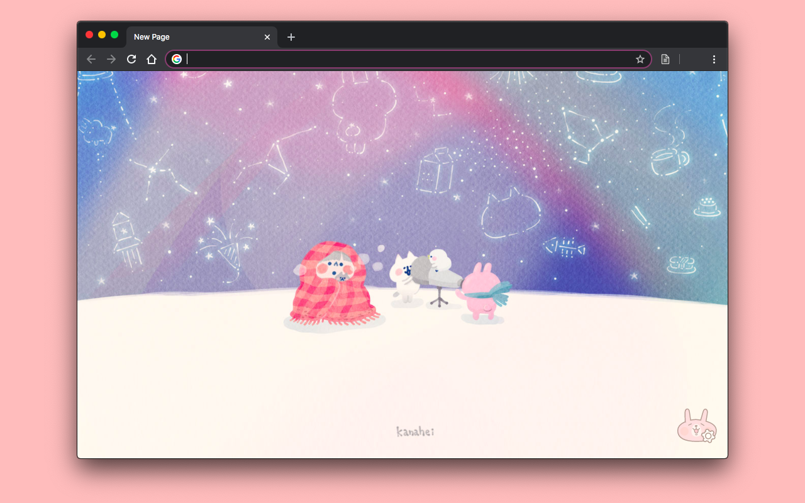
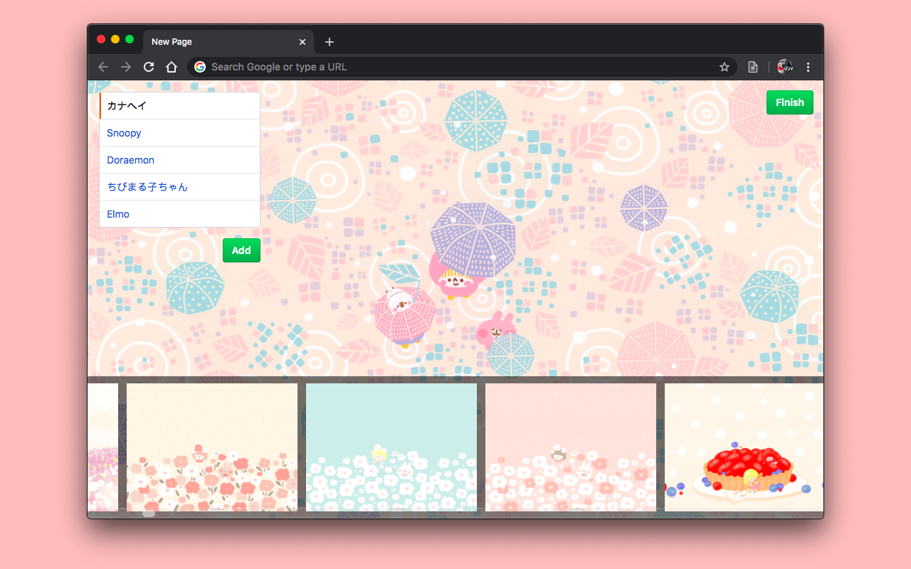
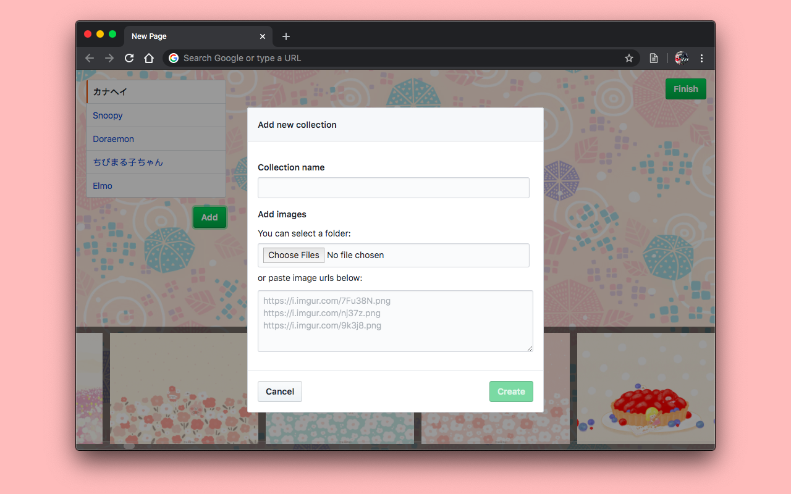

# 分頁壁紙君 - Chrome 擴充功能

在新分頁隨機顯示桌布！

 [][chrome-web-store] [][chrome-web-store] [][chrome-web-store] 

[chrome-web-store]: https://chrome.google.com/webstore/detail/kanaheis-new-page/fbbdincgjgdmbbkongmineooghpadbgk

## Video (Click to view on YouTube)

## Screenshots

## Changelog

[Changelog](https://hackmd.io/@yukai/kabegami-new-page)

## NPM Packages

This extension includes some goodies:

- [`@kabegami-new-page/kanahei.js`][kanahei-js]: Kanahei's wallpaper collection cralwer, with `kanahei` CLI tool that changes your wallpaper with just one command.
- [`@kabegami-new-page/default-sets`][default-sets]: The default wallpapers set comes with Kabegami New Page.

[kanahei-js]: ./packages/kanahei.js/READMD.md
[default-sets]: ./packages/default-sets/READMD.md

## License

MIT
